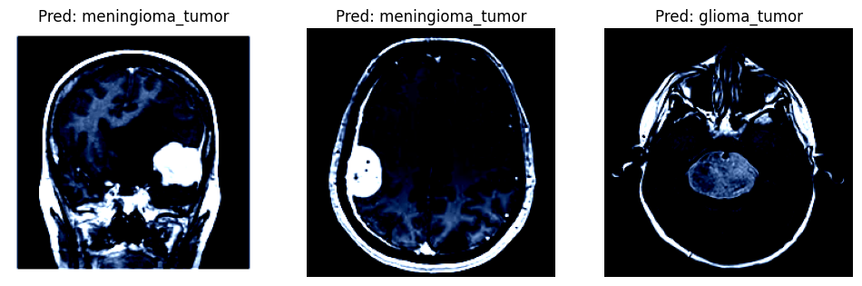
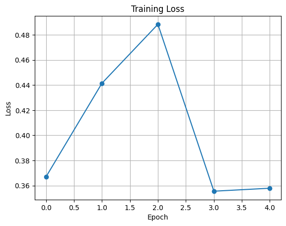
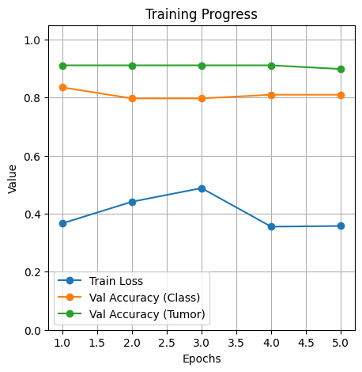
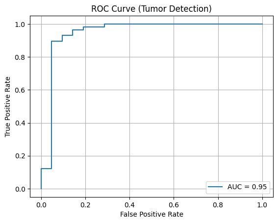
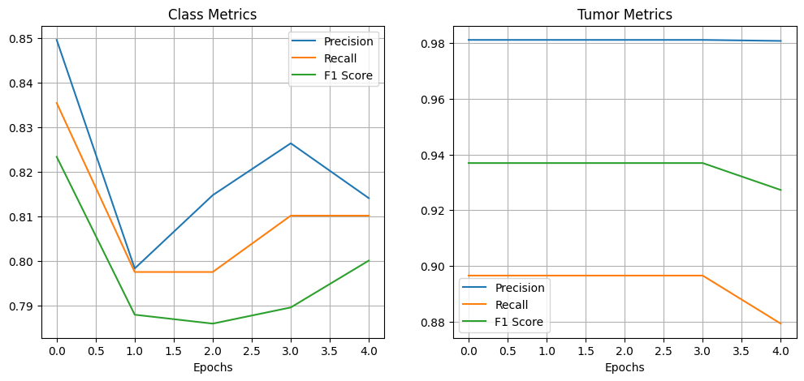
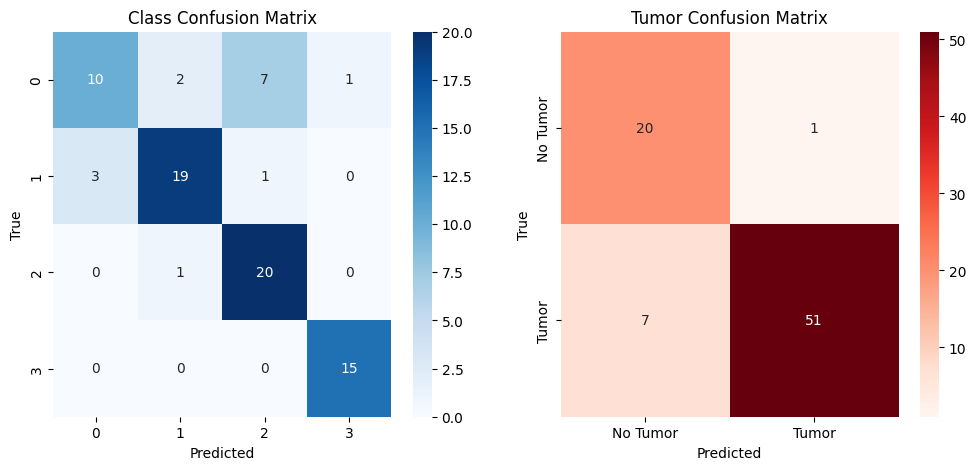
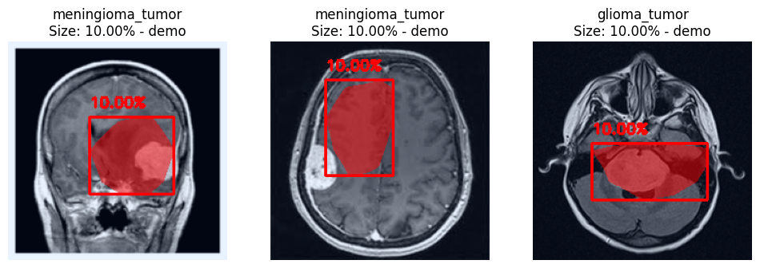

# Demo
# Multi-Task Learning for Brain Tumor MRI Analysis with Explainable AI (Grad-CAM)

## 
This project implements a multi-task deep learning model for brain tumor MRI analysis using transfer learning.

The model performs:
- Multi-class tumor classification
- Binary tumor detection (tumor vs no tumor)
- Explainability using Grad-CAM
- Tumor size estimation from activation maps

---

## Model Architecture
- Backbone: ResNet18 (pretrained)
- Task 1: Multi-class classification (4 classes)
- Task 2: Binary tumor detection
- Multi-task loss: weighted combination of both tasks

---

## Example prediction
### 

## 📊 Results & Visualizations

### 🔹 Training Loss

### 🔹 Accuracy Graph

### 🔹 ROC Curve

### 🔹 Metrics 

### 🔹 Confusion Matrix

---

## Explainability (Grad-CAM)

### 🔹 Tumor Localization & Size Estimation - not fully implemented 

- Highlights important regions in MRI images
- Estimates tumor size (% of image area)
- Draws bounding box around tumor

---

##  Metrics
- Accuracy (Classification & Detection)
- Precision, Recall, F1-score
- ROC-AUC
- Confusion Matrix

---

## Tech Stack
- PyTorch
- Torchvision
- NumPy
- Matplotlib
- OpenCV
- Scikit-learn

---

## 📁 Project Status
⚠️ This is the initial research/demo version.

- Full modular project structure (training pipeline, Streamlit UI, API) is under development and will be updated soon.

---

## Future Work
- Convert into modular project structure
- Deploy using Streamlit / FastAPI
- Improve tumor segmentation accuracy
- Compare with other architectures

---

## 👨‍💻 Author
Sai Deekshith
